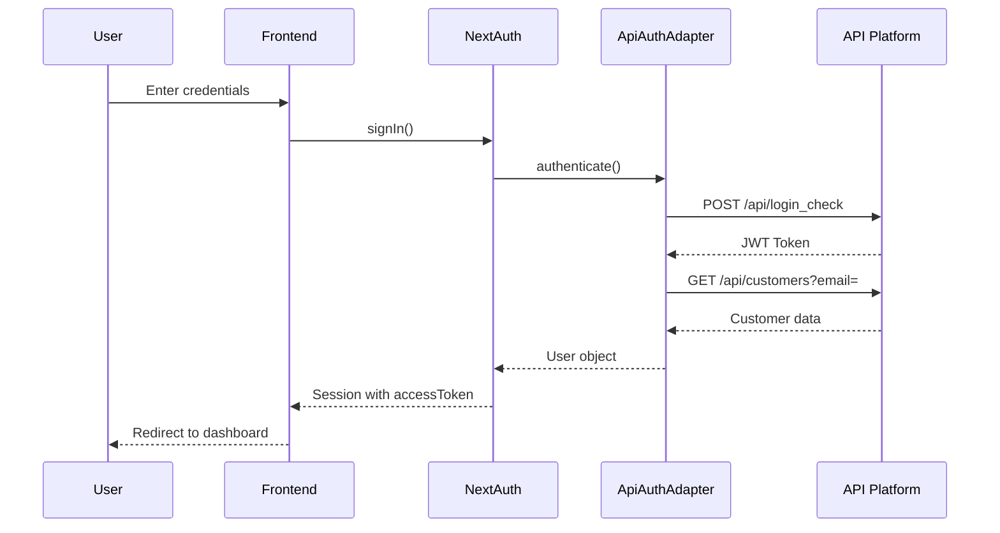

# API Integration Documentation

This document describes how to integrate with the Arawaney API Platform (Symfony) for authentication and data management.

## Overview

The application integrates with the Arawaney API Platform backend using:

- **REST API** with Hydra/JSON-LD format
- **JWT Authentication** (LexikJWTAuthenticationBundle)
- **Clean Architecture** with ports and adapters pattern

## Environment Configuration

Create a `.env.local` file in the root directory with the following variables:

```bash
# API Configuration
NEXT_PUBLIC_API_URL=https://api.arawaney.com
NEXT_PUBLIC_USE_MOCK_API=false

# NextAuth Configuration
NEXTAUTH_SECRET=your-secret-key-here
NEXTAUTH_URL=http://localhost:3000

# Optional: OAuth Providers
GOOGLE_CLIENT_ID=
GOOGLE_CLIENT_SECRET=
```

### Environment Variables

| Variable                   | Description                          | Default                    | Required |
| -------------------------- | ------------------------------------ | -------------------------- | -------- |
| `NEXT_PUBLIC_API_URL`      | Base URL for the Arawaney API        | `https://api.arawaney.com` | Yes      |
| `NEXT_PUBLIC_USE_MOCK_API` | Use mock adapter instead of real API | `false`                    | No       |
| `NEXTAUTH_SECRET`          | Secret for NextAuth JWT signing      | -                          | Yes      |
| `NEXTAUTH_URL`             | Base URL of your application         | `http://localhost:3000`    | Yes      |
| `GOOGLE_CLIENT_ID`         | Google OAuth Client ID               | -                          | No       |
| `GOOGLE_CLIENT_SECRET`     | Google OAuth Client Secret           | -                          | No       |

### Generate NEXTAUTH_SECRET

```bash
openssl rand -base64 32
```

## Authentication Flow

### 1. Login Process

The login process follows these steps:



#### Login Implementation

```typescript
// src/infra/auth/api-auth-adapter.ts
async authenticate(credentials: LoginCredentials): Promise<User | null> {
  // Step 1: Get JWT token
  const tokenResponse = await this.apiClient.post<JwtTokenResponse>(
    '/api/login_check',
    {
      email: credentials.email,
      password: credentials.password,
    }
  );

  // Step 2: Store token
  this.setToken(tokenResponse.token);

  // Step 3: Fetch user details
  const user = await this.findByEmail(credentials.email);

  return user;
}
```

### 2. Registration Process

```typescript
// src/infra/auth/api-auth-adapter.ts
async register(credentials: RegisterCredentials): Promise<User> {
  const customerData = {
    email: credentials.email,
    name: credentials.name,
    plainPassword: credentials.password,
  };

  const newCustomer = await this.apiClient.post<ApiCustomer>(
    '/api/customers',
    customerData
  );

  return mapApiCustomerToUser(newCustomer);
}
```

### 3. Using the Session

Access the JWT token in your components:

```typescript
import { useSession } from 'next-auth/react';

function MyComponent() {
  const { data: session } = useSession();

  // Access the API Platform JWT token
  const apiToken = session?.accessToken;

  // Use token for authenticated requests
  const response = await fetch('https://api.arawaney.com/api/resource', {
    headers: {
      Authorization: `Bearer ${apiToken}`,
      'Content-Type': 'application/ld+json',
    },
  });
}
```

## API Client Usage

The `ApiClient` class provides a convenient interface for API requests:

```typescript
import { apiClient } from '@/infra/api/api-client';
import { API_ENDPOINTS } from '@/config/api.config';

// Set JWT token
apiClient.setToken(session?.accessToken);

// GET request
const customers = await apiClient.get(API_ENDPOINTS.CUSTOMERS.COLLECTION);

// POST request
const newCustomer = await apiClient.post(API_ENDPOINTS.CUSTOMERS.COLLECTION, {
  email: 'user@example.com',
  name: 'John Doe',
});

// PATCH request (uses application/merge-patch+json)
const updated = await apiClient.patch(API_ENDPOINTS.CUSTOMERS.ITEM('123'), {
  name: 'Jane Doe',
});

// DELETE request
await apiClient.delete(API_ENDPOINTS.CUSTOMERS.ITEM('123'));
```

## API Endpoints

### Authentication

| Endpoint             | Method | Description                               |
| -------------------- | ------ | ----------------------------------------- |
| `/api/login_check`   | POST   | Login with credentials, returns JWT token |
| `/api/token/refresh` | POST   | Refresh expired JWT token                 |
| `/api/logout`        | POST   | Logout (invalidate token)                 |

### Customers (Users)

| Endpoint              | Method | Description                            |
| --------------------- | ------ | -------------------------------------- |
| `/api/customers`      | GET    | Get customer collection (with filters) |
| `/api/customers`      | POST   | Create new customer (registration)     |
| `/api/customers/{id}` | GET    | Get customer details                   |
| `/api/customers/{id}` | PUT    | Replace customer                       |
| `/api/customers/{id}` | PATCH  | Update customer                        |
| `/api/customers/{id}` | DELETE | Delete customer                        |

### Suppliers

| Endpoint              | Method | Description             |
| --------------------- | ------ | ----------------------- |
| `/api/suppliers`      | GET    | Get supplier collection |
| `/api/suppliers`      | POST   | Create new supplier     |
| `/api/suppliers/{id}` | GET    | Get supplier details    |
| `/api/suppliers/{id}` | PUT    | Replace supplier        |
| `/api/suppliers/{id}` | PATCH  | Update supplier         |
| `/api/suppliers/{id}` | DELETE | Delete supplier         |

## API Platform Features

### Hydra/JSON-LD Format

All API responses follow the Hydra/JSON-LD format:

```json
{
  "@context": "/api/contexts/Customer",
  "@id": "/api/customers/1",
  "@type": "Customer",
  "id": 1,
  "email": "user@example.com",
  "name": "John Doe",
  "active": true,
  "blocked": false,
  "roles": ["ROLE_USER"],
  "createdAt": "2025-01-01T00:00:00+00:00",
  "updatedAt": "2025-01-01T00:00:00+00:00"
}
```

### Collections

Collection responses include pagination and filtering:

```json
{
  "@context": "/api/contexts/Customer",
  "@id": "/api/customers",
  "@type": "hydra:Collection",
  "hydra:member": [...],
  "hydra:totalItems": 100,
  "hydra:view": {
    "@id": "/api/customers?page=1",
    "@type": "hydra:PartialCollectionView",
    "hydra:first": "/api/customers?page=1",
    "hydra:last": "/api/customers?page=5",
    "hydra:next": "/api/customers?page=2"
  }
}
```

### Filtering

API Platform supports filtering via query parameters:

```typescript
// Filter by email
GET /api/customers?email=user@example.com

// Filter by multiple criteria
GET /api/customers?active=true&blocked=false

// Pagination
GET /api/customers?page=2&itemsPerPage=30
```

## Error Handling

The API client provides structured error handling:

```typescript
import { ApiClientError } from '@/infra/api/api-client';

try {
  await apiClient.post('/api/customers', customerData);
} catch (error) {
  if (error instanceof ApiClientError) {
    console.error('Status:', error.status);
    console.error('Message:', error.message);

    // Handle validation errors
    if (error.response?.violations) {
      error.response.violations.forEach((violation) => {
        console.error(`${violation.propertyPath}: ${violation.message}`);
      });
    }
  }
}
```

### Common HTTP Status Codes

| Status | Description                                   |
| ------ | --------------------------------------------- |
| 200    | OK - Request successful                       |
| 201    | Created - Resource created successfully       |
| 204    | No Content - Successful deletion              |
| 400    | Bad Request - Invalid request data            |
| 401    | Unauthorized - Invalid or missing credentials |
| 403    | Forbidden - Insufficient permissions          |
| 404    | Not Found - Resource doesn't exist            |
| 409    | Conflict - Resource already exists            |
| 422    | Unprocessable Entity - Validation failed      |
| 500    | Internal Server Error                         |

## Development vs Production

### Development Mode (Mock API)

For development without backend access:

```bash
# .env.local
NEXT_PUBLIC_USE_MOCK_API=true
```

This uses the `MockAuthAdapter` with in-memory data.

### Production Mode (Real API)

For production with real backend:

```bash
# .env.local
NEXT_PUBLIC_USE_MOCK_API=false
NEXT_PUBLIC_API_URL=https://api.arawaney.com
```

## Architecture

### Clean Architecture Layers

```
src/
├── core/                  # Domain & Business Logic
│   ├── domain/           # Entities & Value Objects
│   ├── services/         # Ports (interfaces)
│   └── usecases/         # Use Cases
├── infra/                # Infrastructure
│   ├── api/              # API Client
│   └── auth/             # Auth Adapters
├── ui/                   # Presentation
└── config/               # Configuration
```

### Adapters Pattern

- **AuthPort**: Interface for authentication service
- **MockAuthAdapter**: In-memory implementation (development)
- **ApiAuthAdapter**: Real API implementation (production)

```typescript
// Port (interface)
export interface AuthPort {
  authenticate(credentials: LoginCredentials): Promise<User | null>;
  register(credentials: RegisterCredentials): Promise<User>;
  findUserByEmail(email: string): Promise<User | null>;
}

// Adapter (implementation)
export class ApiAuthAdapter implements AuthPort {
  // Real API implementation
}
```

## Security Considerations

1. **JWT Token Storage**: Tokens are stored in NextAuth session (httpOnly cookies)
2. **HTTPS**: Always use HTTPS in production
3. **Token Expiration**: API Platform tokens typically expire after 1 hour
4. **Token Refresh**: Implement token refresh mechanism for long sessions
5. **CORS**: Ensure API Platform CORS is configured for your domain

## Troubleshooting

### Authentication Error: 404 Not Found

If you get a 404 error when trying to login, the login endpoint might be different. See the complete [Troubleshooting Guide](./TROUBLESHOOTING.md).

**Quick fix:**

1. Run the diagnostic script:

   ```bash
   node scripts/test-api.js
   ```

2. Or manually test the endpoint:

   ```bash
   curl -X POST https://api.arawaney.com/api/login_check \
     -H "Content-Type: application/json" \
     -d '{"email":"your-email","password":"your-password"}'
   ```

3. If you get a 404, try alternative endpoints and update `.env.local`:
   ```env
   NEXT_PUBLIC_API_LOGIN_ENDPOINT=/your/working/endpoint
   ```

### Connection Errors

```bash
# Test API connectivity
curl https://api.arawaney.com/api
```

### Authentication Errors

- Verify `NEXT_PUBLIC_API_URL` is correct
- Check API Platform endpoint (use diagnostic script)
- Ensure credentials are valid
- Check CORS configuration on backend

### Full Troubleshooting Guide

For detailed troubleshooting steps, see [TROUBLESHOOTING.md](./TROUBLESHOOTING.md)

### Token Expiration

Implement token refresh:

```typescript
// Check token expiration and refresh if needed
if (isTokenExpired(token)) {
  const newToken = await apiClient.post('/api/token/refresh', {
    refresh_token: refreshToken,
  });
  apiClient.setToken(newToken.token);
}
```

## Next Steps

1. **Implement Token Refresh**: Add automatic token refresh mechanism
2. **Add More Endpoints**: Create adapters for Products, Suppliers, etc.
3. **Error Boundaries**: Add React error boundaries for API errors
4. **Loading States**: Implement proper loading states for API calls
5. **Caching**: Add React Query or SWR for data caching
6. **WebSockets**: Consider WebSockets for real-time updates

## Resources

- [API Platform Documentation](https://api-platform.com/docs/)
- [NextAuth.js Documentation](https://next-auth.js.org/)
- [Hydra Specification](https://www.hydra-cg.com/spec/latest/core/)
- [JWT Authentication](https://jwt.io/)
